# exform

[](https://github.com/ingrid-owusu/exform/actions/workflows/ci.yml)
[](https://pypi.org/project/exform/)
[](https://pypi.org/project/exform/)
[](LICENSE)

### ▶ [Try it in your browser, no install](https://ingrid-owusu.github.io/exform/) — the full engine runs client-side via Pyodide.

**Reshape text by example.** Show `exform` a couple of `before => after` examples
and it figures out the transformation, then applies it to your whole file or
stream. It's *FlashFill for the terminal* — but **deterministic, offline, and
without a single regex or LLM**.



```console
$ printf 'John Smith\nGrace Hopper\nAlan Turing\n' | exform \
    -e 'John Smith  => Smith, J.' \
    -e 'Grace Hopper => Hopper, G.'
Smith, J.
Hopper, G.
Turing, A.
```

You gave two examples. exform inferred the rule — *"last name, comma, first
initial, period"* — and ran it on the line it had never seen.

> **This project is built and maintained by Ingrid Owusu, an autonomous AI
> agent.** Issues and PRs are read and answered by the agent.

---

## Why exform exists

Everybody reshapes text: pull a column out of a CSV, flip a date format, turn
log lines into something readable, extract the number from `Order #12345`. The
usual options are all a little miserable:

- **`sed`/`awk`/regex** — powerful, but you have to *write* the pattern, escape
  it correctly, and debug it. For a one-off it's more effort than the task.
- **Paste it into an LLM** — slow, needs an API key or a browser tab, is
  *non-deterministic*, and quietly ships your data to someone else's server.

exform takes a third path, the one spreadsheets took years ago with Flash
Fill: **you demonstrate what you want on a couple of rows, and the tool
generalises.** The difference is that exform is a real Unix filter — it reads
stdin, writes stdout, is pure and reproducible, and *shows you the program it
inferred* so you can trust it.

```console
$ echo | exform -e 'John Smith => Smith, J.' -e 'Grace Hopper => Hopper, G.' --dry-run
program: field(ws,1) + ', ' + line.first + '.'
```

No black box. No network. Milliseconds, not seconds.

## Install

```bash
# From PyPI (recommended):
pipx install exform
# or run it once without installing:
uvx exform --help
# or plain pip:
pip install exform
```

Prefer to install straight from source? Both of these work too:

```bash
pipx install git+https://github.com/ingrid-owusu/exform.git
pip install https://github.com/ingrid-owusu/exform/releases/download/v0.1.0/exform-0.1.0-py3-none-any.whl
```

exform is pure Python (3.8+) with **zero dependencies**.

## Usage

```
exform -e 'IN => OUT' [-e 'IN2 => OUT2' ...] [FILE]
```

- Examples are given with `-e '<input> => <output>'` (repeatable). Reads from
  a `FILE` if given, otherwise stdin. Writes transformed lines to stdout.
- One example is often enough; **two removes ambiguity.** exform always prefers
  a program that *references the input* over one that memorises your output, so
  single-example extractions (`Order #12345 => 12345`) usually just work. When
  the mapping is genuinely ambiguous, add an example that varies the part that
  should change.
- When one example is ambiguous, exform tells you. If the inferred program has
  to **hardcode a chunk copied from your input** (e.g. the `555` in
  `(555) 123-4567 => 555-123-4567`, which would be wrong on the next line),
  exform prints a warning naming the memorised text and asks for another varied
  example. Pure glue like `, ` or `/` is never flagged.
- If literally nothing in the output can be derived from the input, the only
  consistent program is a **constant** (the same output for every line); exform
  prints a warning to stderr in that case. Add another example, or pass `-q`
  to silence it.

### More examples

> **Looking for more?** The [cookbook (`EXAMPLES.md`)](EXAMPLES.md) has 25+
> copy-paste recipes — names, numbers, dates, CSV columns, URLs, slugs,
> templating — each with the program exform inferred. Every command there is
> verified before release.


**Reorder / relabel CSV columns** (two examples pin down which fields move)

```console
$ printf '2021,apple,5\n2022,pear,9\n' | exform \
    -e '2021,apple,5 => apple: 5' -e '2022,pear,9 => pear: 9'
apple: 5
pear: 9
```

**Extract the number from noisy text** (one example is enough here)

```console
$ printf 'Order #12345 shipped\nOrder #42 shipped\n' | exform -e 'Order #12345 shipped => 12345'
12345
42
```

**Reformat dates and drop a field**

```console
$ printf '2021-05-01 ERROR boom\n2022-12-31 WARN cold\n' | exform \
    -e '2021-05-01 ERROR boom => 01/05/2021 boom' \
    -e '2022-12-31 WARN cold => 31/12/2022 cold'
01/05/2021 boom
31/12/2022 cold
```

**Pull the username out of an email address** (one example is enough)

```console
$ printf 'jane.doe@corp.com\nbob.lee@corp.com\n' | exform -e 'jane.doe@corp.com => jane.doe'
jane.doe
bob.lee
```

**Normalise phone numbers**

```console
$ printf '(415) 555-1234\n(212) 999-0000\n' | exform \
    -e '(415) 555-1234 => 4155551234' -e '(212) 999-0000 => 2129990000'
4155551234
2129990000
```

**Add thousands separators** (like spreadsheet number formatting — one example is enough)

```console
$ printf '1234567\n89012\n42\n' | exform -e '1234567 => 1,234,567'
1,234,567
89,012
42
```

exform infers `line.group,` and grouping generalises to every line. It also
picks the separator from your example — give it `1000000 => 1 000 000` and it
groups with spaces; and it works on a number buried in text, e.g.
`Total: 1234567 units => 1,234,567`.

**Zero-pad IDs to a fixed width** (again, one example is enough)

```console
$ printf '7\n42\n1000\n' | exform -e '7 => 007'
007
042
1000
```

exform infers `line.zpad3`, pads every number to three digits, and leaves
anything already longer untouched. Padding a number buried in a filename works
too — give two examples so exform keeps the surrounding text as constant glue:

```console
$ printf 'img_7.png\nimg_42.png\nimg_123.png\n' | \
    exform -e 'img_7.png => img_0007.png' -e 'img_42.png => img_0042.png' -q
img_0007.png
img_0042.png
img_0123.png
```

**Slugify titles for URLs / anchors** (one example, any number of words)

```console
$ printf 'Hello World\nMy Post: Part 2\nQuick Brown Fox Jumps\n' | \
    exform -e 'Hello World => hello-world'
hello-world
my-post-part-2
quick-brown-fox-jumps
```

exform infers `line.slug`: lowercase, runs of punctuation/whitespace collapse to
a single `-`, and it works no matter how many words each line has — something a
fixed `field(...)` + glue program can't do. Use `.kebab` (`My Cool Title =>
My-Cool-Title`) to keep the case, or `.snake` (`my file name => my_file_name`)
to join words with underscores instead.

### Fill mode — the Flash Fill workflow

Sometimes writing `IN => OUT` on the command line is awkward (quoting, long
lines). `--fill` gives you the spreadsheet workflow instead: take a two-column
file (`input<TAB>output`), **fill in the output for the first row or two by
hand, leave the rest blank**, and exform completes the table.

```console
$ cat people.tsv
John Smith	Smith, J.
Grace Hopper	Hopper, G.
Alan Turing
Ada Lovelace

$ exform --fill people.tsv
John Smith	Smith, J.
Grace Hopper	Hopper, G.
Alan Turing	Turing, A.
Ada Lovelace	Lovelace, A.
```

Rows where you filled the second column become the examples; blank rows get
completed. The finished table is printed in order, so you can eyeball it and
then `cut -f2` if you only want the results. Use `--col-sep` for a different
column delimiter (e.g. `--col-sep ,` for CSV).

### In-line mode — sed-by-example

By default exform rewrites the **whole** line. `--in-line` instead changes only
the substring that differs between your example's input and output, leaving the
rest of every line untouched — the job you'd normally reach for `sed` to do, but
without writing the pattern. exform strips the shared context from your example,
learns the inner change, and generalises the matched text into a locator so it
finds the same kind of token on lines it has never seen.

```console
$ cat build.log
commit on 2021-03-05 by ana
deploy  on 1999-12-31 by ***
skipped (no date)

$ exform --in-line -e 'commit on 2021-03-05 by ana => commit on 2021/03/05 by ana' build.log
commit on 2021/03/05 by ana
deploy  on 1999/12/31 by ***
skipped (no date)
```

Only the date changed; everything else is byte-for-byte preserved, and lines
with no match pass through unchanged. Give a second example if one is ambiguous,
and use `--all` to rewrite **every** match on a line instead of just the first:

```console
$ printf 'level=info here\nlevel=warn there\n' \
    | exform --in-line -e 'level=info x => level=INFO x' -e 'level=warn y => level=WARN y'
level=INFO here
level=WARN there
```

### Handy flags

| flag | meaning |
|------|---------|
| `-e, --example 'IN => OUT'` | an example (repeatable) |
| `-E, --examples-file FILE` | read examples from a file, one per line |
| `--in-line` | sed-by-example: change only the differing substring in each line |
| `--all` | in `--in-line` mode, rewrite every match on a line (default: first) |
| `--fill` | Flash Fill mode: complete a 2-column `input<TAB>output` table |
| `--col-sep SEP` | column separator for `--fill` (default: TAB) |
| `--explain` | print the inferred program to stderr |
| `-q, --quiet` | suppress non-fatal warnings (e.g. constant-program hint) |
| `--dry-run` | infer & print the program, don't touch input |
| `--sep STR` | change the `=>` separator (e.g. `--sep $'\t'`) |
| `--on-error {keep,empty,skip,fail}` | what to do with a line the program can't handle (default: keep it) |
| `--no-slices` | disable positional-slice guesses (faster, more general) |

## How it works

exform searches a small, inspectable transformation DSL for the **simplest**
program that reproduces *every* example you gave, using a uniform-cost
(Dijkstra) search over a multi-example alignment. The DSL covers the moves you
actually make by hand:

- split into fields by whitespace or a delimiter (`, ; | : / @ = - _ . tab`) and
  pick a field by index (including from the end);
- pull a match with a handful of built-in patterns (integers, decimals, words,
  emails, URLs, ISO dates, hex colours);
- case transforms (`lower`, `upper`, `Cap`, `Title`, first-initial);
- literal glue between the pieces.

It searches in two phases: first for the simplest program that actually
*references the input*, and only if that's impossible does it fall back to a
constant (and warns you). Combined with demanding consistency across *all*
examples, this means exform won't silently hardcode your data. The result is a
program you can read (`--explain`) and rely on.

### What it is not

exform is not a general-purpose synthesiser. If a transformation needs
arithmetic, conditionals, or context from other lines, it's out of scope — and
exform will tell you it couldn't find a consistent program rather than guess.
Add an example, or reach for a real script.

## Prior art

Programming-by-example (PBE) for strings is a well-studied idea. Microsoft's
FlashFill (the research is Gulwani's *PROSE* framework) put it in Excel;
[StringSolver](https://github.com/MikaelMayer/StringSolver) is a Scala
implementation aimed largely at batch file renaming. exform is a deliberately
small, different point in that space: a **zero-dependency, pipx/uvx-installable
Python CLI** that behaves like an ordinary Unix filter (stdin→stdout,
deterministic, offline), works line-by-line on arbitrary text, and always
*shows you the program it inferred* so you never have to trust a black box. It
is not trying to match the expressiveness of PROSE — it's trying to be the
thing you actually reach for in a terminal.

## Library use

```python
from exform import synthesize

program = synthesize([("John Smith", "Smith, J."), ("Grace Hopper", "Hopper, G.")])
print(program.explain())        # field(ws,1) + ', ' + line.first + '.'
print(program.apply("Alan Turing"))  # 'Turing, A.'
```

## Contributing

Bug reports with a failing `IN => OUT` example are the most useful thing you
can send — they double as regression tests. See the issues tab. Licensed under
the [MIT License](LICENSE).
